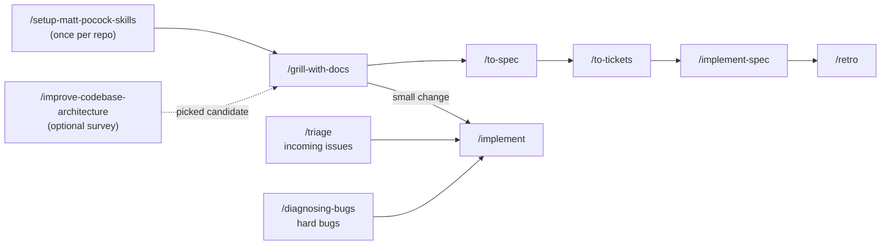

# Brownfield Workflow: Existing Codebase → Agent Implementation

Add features, fix bugs, and improve design in an existing codebase. This is the same **main flow** as the [greenfield workflow](greenfield-workflow.md), plus three **on-ramps** for the situations existing codebases create. It is based on [mattpocock/skills](https://github.com/mattpocock/skills).



---

## 0. Setup (once per repo)

```
/setup-matt-pocock-skills
```

Same as greenfield. It detects GitHub or Azure DevOps from `git remote` and records the tracker in `docs/agents/issue-tracker.md` (CLI first, MCP fallback).

## 1. Build a feature (main flow)

```
/grill-with-docs I want to <change>. Explore the code first.
```

The agent reads the existing code to answer factual questions itself and only asks you for decisions. It seeds `GLOSSARY.md` with the terms the codebase already uses and records key decisions as ADRs. What happens next depends on the size of the change:

- **Multi-session change**: `/to-spec` → `/to-tickets` → `/implement-spec`, exactly as in greenfield. `/to-tickets` puts **prefactoring** tickets first ("make the change easy, then make the easy change") and sequences wide renames as expand → migrate → contract.
- **Fits in one session**: `/implement` right after grilling, in the same context.

Close with `/retro`.

## 2. On-ramps

| Situation | Command | What happens |
| --- | --- | --- |
| Bugs and requests piling up | `/triage` | Moves raw issues through triage labels (`needs-triage` → `ready-for-agent` / `ready-for-human` / `needs-info` / `wontfix`), writing an agent brief for ready ones. Then `/implement <issue>`. Only triage issues you didn't create; tickets from `/to-tickets` are already agent-ready. |
| Something's broken and it isn't obvious why | `/diagnosing-bugs` | Builds a feedback loop that fails on *this* bug, then minimises → hypothesises → instruments → fixes → adds a regression test. |
| The code is hard to change | `/improve-codebase-architecture` | Surveys for **deepening opportunities** and presents them as an HTML report. Pick one and it becomes an idea for step 1. Run it every few days. |

## Tips for existing codebases

- Before the first feature, run `/grill-with-docs` once on "how this codebase is organised" to seed the glossary.
- Add a `CLAUDE.md` or `AGENTS.md` with build and test commands. `/implement` and `/tdd` depend on fast feedback loops.
- After a rough session, `/retro` turns repeated mistakes into checks or coding standards that `/code-review` then enforces.

## Skills used

| Skill | Purpose |
| --- | --- |
| `/setup-matt-pocock-skills` | Configure tracker (GitHub/Azure DevOps), labels, doc layout |
| `/grill-with-docs` | Align on the change; grounds `GLOSSARY.md` + ADRs in existing code |
| `/to-spec`, `/to-tickets` | Spec and tracer-bullet tickets on the tracker |
| `/implement-spec`, `/implement` | Build (parallel or single-session), driving `/tdd` + `/code-review` |
| `/triage` | Turn incoming issues into agent-ready work |
| `/diagnosing-bugs` | Disciplined debugging loop |
| `/improve-codebase-architecture` | Find deepening opportunities |
| `/retro` | Improve the agent environment |
