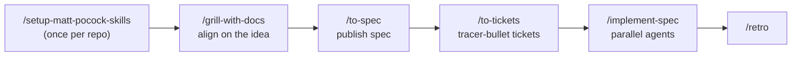

# Greenfield Workflow: Idea → Agent Implementation

Take a new idea to working, reviewed code with a small set of composable skills. This follows the **main flow** from [mattpocock/skills](https://github.com/mattpocock/skills) (see its `ask-matt` skill), adapted for GitHub Copilot CLI with GitHub or Azure DevOps as the tracker.



Five commands take you from idea to a reviewed PR. Everything else (worktrees, TDD, merging, code review, PR body) happens inside `/implement-spec`.

---

## 0. Setup (once per repo)

```
/setup-matt-pocock-skills
```

Picks the issue tracker (**GitHub** via `gh`, or **Azure DevOps** via `az boards`, each falling back to its remote MCP server in `.mcp.json`), triage labels, and where `GLOSSARY.md` and ADRs live. It writes `docs/agents/*.md` and an `## Agent skills` block in `AGENTS.md`/`CLAUDE.md`.

## 1. Align: grill the idea

```
/grill-with-docs I want to build <rough idea, or @idea.md>
```

The agent interviews you in rounds, giving a recommended answer for each question, until every branch of the design is settled. As terms and hard-to-reverse decisions come up, it records them in `GLOSSARY.md` and `docs/adr/`. Future agents then speak your language.

> No repo yet, or not a code task? Use `/grill-me` instead. It runs the same interview without writing any files.

## 2. Spec

```
/to-spec
```

Synthesizes the conversation into a spec (problem, solution, user stories, implementation and testing decisions, out of scope), confirms the test seams with you, and publishes it to the tracker as a `ready-for-agent` issue or work item. No new interview.

## 3. Tickets

```
/to-tickets
```

Breaks the spec into **tracer-bullet** vertical slices, each small enough for one fresh context window, and quizzes you on granularity and blocking edges. It then publishes them to the tracker with **native blocking links** (GitHub issue dependencies, or Azure DevOps Predecessor links).

> **Context hygiene**: keep steps 1–3 in **one session**, so the spec and tickets build on the full grilling. Don't clear or compact until the tickets are published.

## 4. Implement

```
/implement-spec <spec issue number or URL>
```

Treats the tickets as a **task graph** and runs the whole spec on one **integration branch**:

1. Runs background **implementer subagents** for every ticket on the ready frontier, each in its own git worktree, each driving `/tdd` (red → green → refactor)
2. Merges each finished ticket into the integration branch with a merger subagent, then starts the tickets that just became unblocked
3. Runs `/code-review` (standards + spec, as parallel sub-agents) on the integration branch and fixes the findings
4. Opens or readies the PR (body shaped by `/pr`) and resolves the tickets

> Prefer to drive it yourself? Run `/implement <ticket>` per ticket, clearing context between tickets. For a small change that doesn't need tickets, run `/implement` straight after step 1.

## 5. Retro

```
/retro
```

Run it in the same session, before you clear. It suggests changes to the agent's **environment**, not the code: automated checks, coding standards, steering files, navigation pointers. The next build then starts from a better setup.

---

## Skills used

| Skill | Step | Purpose |
| --- | --- | --- |
| `/setup-matt-pocock-skills` | 0 | Configure tracker (GitHub/Azure DevOps), labels, doc layout |
| `/grill-with-docs` | 1 | Interview to shared understanding; builds `GLOSSARY.md` + ADRs |
| `/to-spec` | 2 | Conversation → spec on the tracker |
| `/to-tickets` | 3 | Spec → tracer-bullet tickets with blocking links |
| `/implement-spec` | 4 | Parallel, worktree-based implementation on an integration branch |
| `/tdd`, `/code-review`, `/pr` | 4 | Used inside `/implement-spec` |
| `/retro` | 5 | Improve the agent environment |

## Why this shape

| Pattern | Why |
| --- | --- |
| Grill before you spec | Most failures come from misalignment, not bad code |
| Shared glossary + ADRs | Shorter prompts, consistent names, fewer tokens |
| Vertical slices with blocking edges | Each ticket is demoable and independently grabbable; the frontier drives parallelism |
| TDD at agreed seams | Tight feedback loops keep agents honest |
| One integration branch, one review | Parallel work, one coherent PR |
